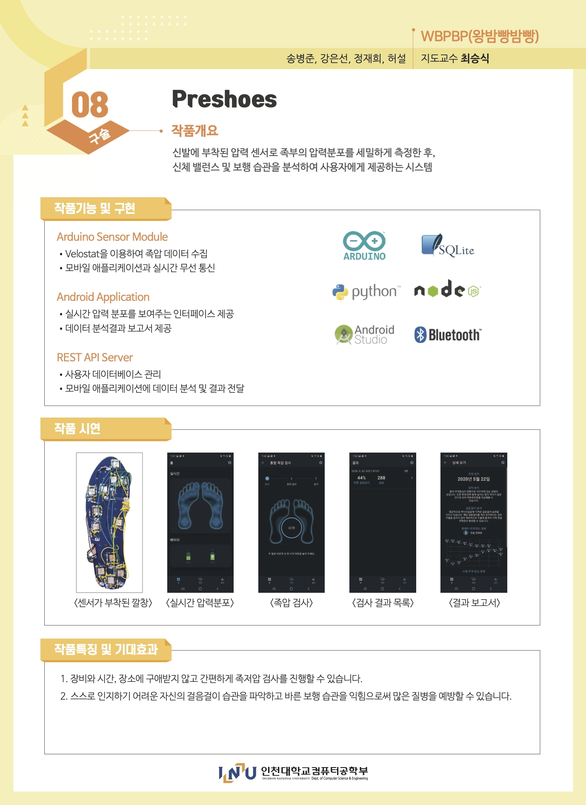

# preshoes-docs

Preshoes - 문서

Preshoes 개발과 관련된 모든 문서를 포함합니다.

## 문서 바로가기

- [최종 발표 슬라이드](slides/Preshoes.pptx) (GitHub)
- [최종 발표 슬라이드](https://www.slideshare.net/ByeongJunSong2/preshoes-235262973) (SlideShare)
- [최종 발표 영상](https://youtu.be/JYdxtOJ4cAg) (Youtube)
- [프로젝트 실무 계획서](formed/plan.md)
- [프로젝트 실무 요구사항 분석서](formed/requirements.md)
- [프로젝트 실무 개념 설계서](formed/concepts.md)
- 프로젝트 실무 시스템 설계서
- 프로젝트 실무 시험 결과서

## Preshoes란?

[IdeaBoom 바로가기](http://www.ideaboom.net/page/project_detail.php?seq=1673)

**Preshoes는 신발에 부착된 압력 센서로 족부의 압력분포를 세밀하게 측정하고 신체 밸런스 및 보행 습관을 분석하여 사용자에게 제공하는 서비스입니다.**

## 프로젝트 진행 기록

### 3주차
- `정재희`: 현재 어떻게 분석할 지 공부 중이며 논문들을 읽고 우리에게 가장 맞는 방법을 파악 중입니다. 지금은 COP(cneter of pressure)를 이용한 방법에 대해 자세히 공부 중입니다.
- `강은선`: 먼저 2x2로 만들어 보려고 인터넷 검색어 알려주신것 봤는데 아직 잘 모르겠어서 일단 센서 여러개 연결해서 다루는 거 익히는 중입니다...
- `송병준`: 매니저 고용. Navigation 라이브러리 작성 완료. Kotline coroutine 학습 완료. 도메인 엔티티 설계중.
- `허설`: 급한 불끄기... 알바 후... 자정안으로 올릴게요 ㅎㅎ훟ㅎㅎ.ㅎ.ㅎ..ㅎ.ㅎ.ㅎ 죄송합니다...

### 4주차
- `송병준`: 일관된 에러 처리를 위한 Failable 라이브러리 작성 및 테스트 완료.
- `강은선`: 네... 죄송합니다만... 이번주 데통 과제로 금요일까지 골머리를 썩는 바람에... 아무것도 하지 못했습니다.... 제가 쓰레기입니다...
- `정재희`: 현재 다양한 방법들을 찾아보면서 최대한 저희 현실과 맞는 방법들을 찾고있습니다! 그리고 혹시 제가 감이 안잡히는데 처음 블루투스로 데이터를 받으면 어떤 값이 오는건지 예를 들어주실수 있으신가요....??

### 5주차
- `정재희`: 저..늦었지만 현재 걸음걸이를 정확히 파악하기 위해 보행상태를 구분할 수있는 방법을 공부하고 있으며 동시에 질병예측을 위해 여러 논문을 보고있지만 병마다 원하는 측정값이 다르고 방법도 달라 일원화를 어떻게 할지 고민중입니다.
- `송병준`: 블루투스 통신모듈과 모듈로부터 넘어온 데이터 가져오는 Repository 설계중. 사용되지 않은 (구독자가 없는) 데이터는 back pressure 없이 바로 소멸됨.

### 6주차
- `송병준`: 이번 주에는 한 게 없습니다
- `허설`: 어제 회원가입에 필요한 정보기입이랑 아이디 중복방지, 회원탈퇴까지 만들었습니다 . 비밀번호인식을 단순하게 만들었는데 시간이 되면 좀더 보안에 좋도록 만들어보겠습니다
- `정재희`: 죄송합니다. 요번주는 너무 바빠서 다음주에 꼭 할겠습니다
- `강은선`: 이번주에 너무 바빠서... 당분간 시험기간이라 작업 많이 못할것같습니다..

### 7주차
- `송병준`: 도메인 및 UI 설계중입니다.

### 8주차
- `정재희`: 사실....저...이제 모르겠어요ㅠㅜㅜㅠㅜㅠ어떻게 해야할지ㅠㅠㅠ
- `송병준`: 지난 주와 같습니다.

### 9주차
- `송병준`: 탭 전환 라이브러리 보완 / 족부 압력분포 표시하는 커스텀 뷰 FootPressureView 완성 및 적용 완료 / Home | Diagnose | Report 3기능 화면 분할 / 압력 데이터 도메인 엔티티 설계

### 10주차
- `정재희`: 현재 저수준데이터분석기 구현완료하였으며 고수준데이터분석기는 현재 기본 틀 구현완료하였으며 신발 완성 후 들어오는 데이터에 따라 코드변경하여 마무리할 예정입니다.
- `송병준`: 애플리케이션 UI에 뷰모델 바인딩 준비중 / FakeDataGenerator 구현, 데모 영상 완성.

### 11주차
- `송병준`: 대략 70% 완료됨. / 보고서 상세 화면 구현 완료. 테스트중 / 홈 화면, 진단 화면 구현과 테스트 완료 / 데이터 분석기 및 서버와 연동 완료

### 13주차
- `정재희`: 끝~~~~~~~~~~~~~~~~~~~~~~~~~~~~~~~~~~~~
- `송병준`: 매니저님 고생했어요 빠이 :wave: / 센서모듈 배선 대신 동박 커팅 기판 사용하는 방법으로 선회, 프로토타입 2차 완성, 완제품 설계, 제작, 테스트 완료. 샘플간 딜레이 감소 및 데이터 손실 방지하여 안정성 개선, 애플리케이션 mock서버와 fake 디바이스간 전환 가능한 build variant 설정 구축, DB-스레드 예외 해결, reactive 데이터 흐름 구축, 센서 모듈과 앱 간 새로운 통신 프로토콜 도입, 설계 및 구현 완료. 발표 슬라이드 보완, 완성. 발표영상 녹음, 시연영상 촬영, 최종영상 편집, 완성. IdeaBoom 작품페이지 지면 디자인, 편집, 데모 스크린샷 및 gif 추가. 저장소 내 모든 TODO 제거, GitHub 문서 업데이트, 이슈 종결, 마일스톤 도달, 모든 프로젝트 종료.

