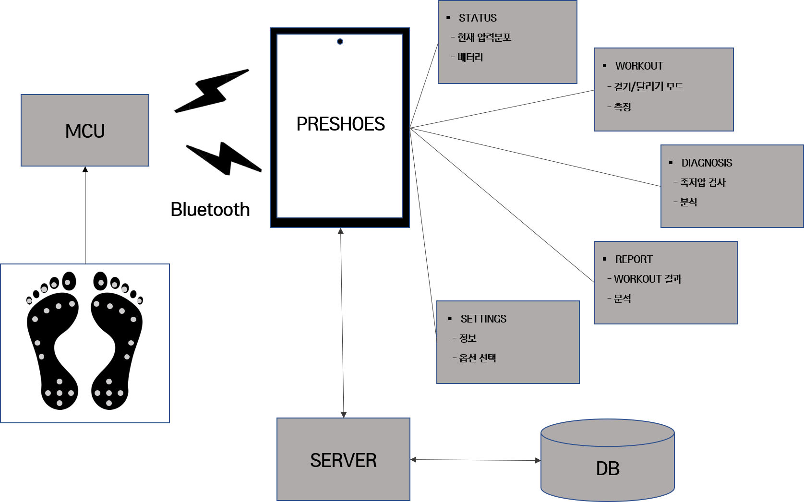

## 문서 개정 이력
|작성일|설명|담당자|
|:-:|:-:|:-:|
|2019.12.01|업로드, 마크다운으로 전환.|송병준|

# 프로젝트 실무 개념 설계서
## 프로젝트 명
PRESHOE

## 제작학생명
|학번|이름|연락처|E-mail|
|:-:|:-:|:-:|:-:|
|201701562|송병준|010-****-2661|potados99@gmail.com|
|201701524|강은선|010-****-7047|dmstjs7047@hanmail.net|
|201501495|허설|010-****-6603|hseol96@naver.com|
|201701594|정재희|010-****-3018|wjfwogml5890@naver.com|

## 시스템 요약
**일상 생활 속에서도 간편하게 자신의 보행 습관을 기록, 분석하고 빠르게 시각적 피드백을 받을 수 있도록 한다.**

### 1. 센서 모듈
센서 모듈은 신발 내/외에 위치하며, 사용자의 발에 가해지는 압력의 분포를 측정 및 수집하여 사용자의 휴대 전화로 전송하는 역할을 한다.

#### 1.1. 기능
##### 압력 센서로부터 데이터 수집
신발 내에 분포된 압력 센서들로부터 데이터를 빠르게 읽는다.

##### 수집된 데이터 전송
센서로부터 수집되 데이터를 가장 효율적인 형태로 가공하여 사용자의 휴대전화로 전송한다.

#### 1.2. 요구사항
- **내진, 방진, 방수**
- **심미성을 해치지 않을 만큼 작은 부피**
- **사용성을 해치지 않을 만큼 적은 무게**
- **최소 10시간의 배터리 성능**
- **최소 12개 이상의 압력 센서**
- **적은 지연 시간**

### 2. 애플리케이션
사용자의 휴대전화에 설치되어 구동되며, 신발에 위치한 센서 모듈로부터 압력 측정 데이터를 수집하여 가공하여 사용자에게 보여준다.     
또한 이를 피트니스 기능과 접목시켜 걷기 또는 뛰기 운동을 기록하고, 이를 기반으로 상세한 운동 보고서를 보여준다.

#### 2.1. 기능
##### 현재 발 압력분포 상태 확인
애플리케이션이 수신한 데이터를 바로 발 모형 그래픽으로 시각화하여 보여준다. 실시간으로 발에 가해지는 압력의 분포를 볼 수 있도록 한다.

##### 정적 족저압 검사
가만히 정지해있는 상태에서 발에 가해지는 압력 분포를 분석함으로써 가만히 서 있는 자세를 진단하고 이에 대한 피드백을 전달한다.

##### 걷기 또는 뛰기 운동 기록
휴대전화의 GPS와 고도계 등과 협력하여 걷기 또는 뛰기 운동을 기록한다. 운동 중에는 커다란 UI를 제공하여 현재 이동 거리, 속력, 소모 열량, 자세 진단 등을 표시한다.

##### 운동 기록과 상세 보고서 열람
운동 기록을 정밀하게 분석하여 이동 거리, 운동 시간, 평균 속력, 소모 열량, 이동 고도 등 일반적인 지표 뿐만 아니라 양발 밸런스, 무게중심 이심률, 보행 각도, 보행 습관 진단 등 심층적인 정보를 제공한다.

##### 설정
애플리케이션을 사용하면서 발생할 수 있는 요구에 대응하기 위한 개인화 설정, 기기 동기화 설정 등을 제공한다.

#### 2.2. 요구사항

- **프로덕션 수준의 심미성**
- **매뉴얼이 필요 없을 만큼의 사용성**
- **배터리 사용량 최소화**
- **빠른 페어링**
- **안정적인 무선 연결**
- **0%대의 ANR과 처리되지 않은 예외 발생률**

### 3. 서버
온라인 스토리지로서 휴대전화 애플리케이션을 보조하는 역할을 한다.    
신발로부터 수집 후 가공한 운동 데이터 등을 사용자의 계정과 연결하여 저장하고 요청에 따라 사용자에게 이를 제공한다.

#### 3.1. 기능
##### 회원 관리
회원 가입, 로그인, 비밀번호 찾기 등의 기능을 제공한다.

##### 데이터 동기화 및 백업
사용자의 로컬 데이터의 복사본을 유지하면서, 사용자의 휴대전화와 서버가 같은 가지도록 동기화한다.

#### 3.2. 요구사항
음...

## 아키텍쳐

### 1. 센서 모듈

### 2. 애플리케이션

### 3. 서버
