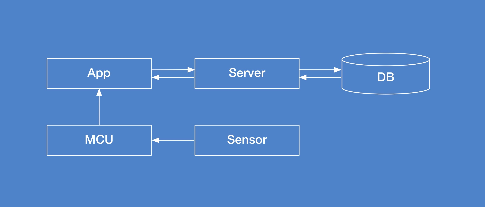
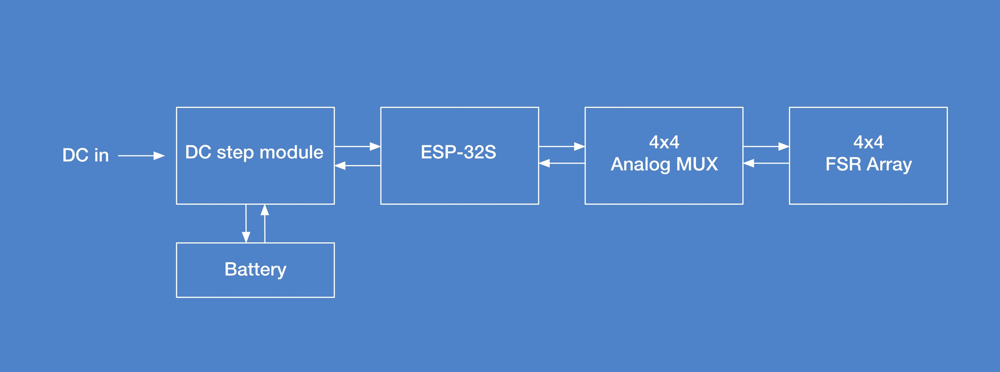
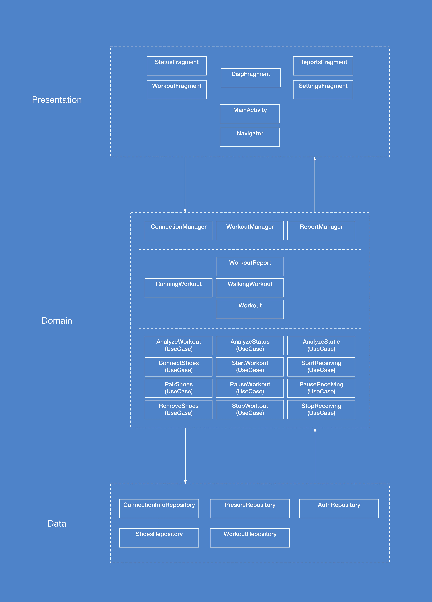

## 문서 개정 이력
|작성일|설명|담당자|
|:-:|:-:|:-:|
|2020.06.16|최초 작성.|송병준|
|2020.06.23|내용 추가.|송병준|
|2020.06.26|이미지 추가.|송병준|

# 캡스톤디자인 상세 설계서
## 프로젝트 명
Preshoes(프레슈)

## 제작학생명
|학번|이름|연락처|E-mail|
|:-:|:-:|:-:|:-:|
|201701562|송병준|010-****-2661|potados99@gmail.com|
|201701524|강은선|010-****-7047|dmstjs7047@hanmail.net|
|201501495|허설|010-****-6603|hseol96@naver.com|
|201701594|정재희|010-****-3018|wjfwogml5890@naver.com|

## 각 컴포넌트 정의 및 설계
> ※ 아키텍처를 구성하는 컴포넌트들의 기능 및 컴포넌트들 간의 인터페이스 상세 기술

아키텍처를 구성하는 컴포넌트는 크게 모듈, 모바일 애플리케이션, 서버, 데이터 분석으로 나뉜다.

### 공용 룰
아키텍처 공용 룰은 개발을 용이하게 하기 위해 정한 것으로 각 아키텍처 간에공통으로 알아야 할 것을 규칙으로 정해놓은 것이다.

1. 양발의 센서패드는 따로 관리한다.

2. 센서패드를 최초 연결할 시 pin 등의 인증절차는 없으며 재 연결 시에는 이전에
  연결했던 기기가 자동으로 연결된다.

3. 데이터 및 회원 관리는 동기화 시스템을 적용한다. 이때, 수집하는 사용자 데이터는
  ID, 이메일, 비밀번호, 나이, 성별, 신장이며, 이 중 압력 데이터 분석에 사용되는
  데이터는 나이, 성별, 신장이다.

4. 데이터 처리는 로컬이서 raw 데이터로부터 실시간으로 특징점을 추출한 후 서버
  리소스를 사용해 특징점으로부터 유의미한 통찰을 도출한다.

### 모듈

#### 센서 패드

 센서 패드는 velostat을 사용하여 만든 16개의 센서로 이루어져 있다. velostat은
가해지는 압력의 세기에 따라 저항값이 달라지는 물질로 해당 물질의 특징을 이용하여
흐르는 전류의 값으로 센서에 가해지는 압력을 측정한다.

#### 보조 아두이노 기기

 센서 패드의 센서에 연결된 케이블이 아두이노의 아날로그 핀에 연결되어 센서 각각의
압력 값을 데이터화 한다. 이때, 16개의 모든 센서에 압력이 가해지므로 각각 센서의
압력 값으로 배열을 만들어 전송한다. 따라서 한번 센서의 데이터를 읽을 때 이동하는
총 데이터의 크기는 16 X 4bit로 총 8byte이다.

#### 블루투스

모듈과 모바일 애플리케이션 간의 통신은 블루투스를 이용한다.

##### 최초 연결

모듈에 전원이 들어가면 페어링이 시도된다. 이때, 모듈의 EEPROM에 다른 기기의
MAC 주소가 저장되어 있다면 모듈에 있는 초기화 버튼을 눌러야 한다. 모듈에
저장되어 있는 주소가 없다면 즉시 연결되며 해당 기기의 MAC 주소가 저장된다.

##### 재연결

모듈에 전원이 들어가고 이전에 연결했던 기기에 페어링을 시도할 때, 모듈은 해당
기기의 MAC 주소를 확인한 후 주소가 모듈에 저장되어 있는지 확인한다. 일치하면
연결에 성공하고, 불일치 시 연결을 거절하거나 연결이 수립된 경우 연결을 해제한다.

##### 연결 해제

모듈과 기기의 연결을 해제하는 방법에 두 가지가 있다. 첫 번째, 모듈의 초기화
버튼을 누른다. 버튼을 누르면 모듈의 리셋 프로시저가 활성화되고 모듈과 기기의
연결이 해제된 후 모듈에 저장된 해당 기기의 MAC 주소가 삭제된다. 이후에 다시
연결할 때는 최초 연결 방식을 사용하여 연결한다. 두 번째는 모바일 애플리케이션을 종료하는 것이다. 모바일 애플리케이션이 종료될 때 앱이 완전히 종료되기 전에
모듈과 기기의 연결을 해제하는 코드가 실행된다. 해당 방법으로 연결을 해제 했을
때는 이후 연결 시에 재연결 방식을 사용한다.

### 모바일 애플리케이션

####  공용

- `Koin`: 의존성 주입 라이브러리로, 싱글턴 객체를 모바일 애플리케이션 전역에서 호스팅하기 위해 사용한다.
- `modules`: 모바일 애플리케이션이 시작할 때에 초기화될 싱글턴 객체의 정의이다.

#### 일반
- `User`
: 모바일 애플리케이션을 사용하는 사용자에 대한 정보를 담는 도메인 엔티티 객체이다.
 사용자의 식별자, 성별, 나이, 체중, 신장을 포함한다.

- UserAuth
: 사용자의 인증 정보를 담는 도메인 엔티티 객체로 자동 로그인에 사용할 토큰을
 포함한다. 해당 객체는 일반적으로 User의 개념으로부터는 ‘토큰’이 떠오르지 않기
 때문에 User에서 분리, 개별의 객체로 설정한다.

- UserWalkingPattern
: 사용자의 걸음걸이 패턴을 담는 도메인 엔티티 객체로 User 객체와 같은 식별자를
 공유한다. 이는 정규화된 것으로, 관계형 데이터베이스에서 외래 키로 Users 테이블을
 지정할 수 있도록 설계한 것이다.

- UserRepository
: 사용자의 정보를 담고 있는 저장소로 User를 다룬다.

- UserAuthRepository
: 사용자의 인증 정보를 담고 있는 저장소로 UserAuth를 다룬다.

#### 블루투스 통신

- BTAgent
: 블루투스 서비스와 기능을 wrapping하는 객체이다. 해당 객체는 주변 블루투스
 객체에 대한 스캔과 연결을 대행하며, 연결이 성립되면 블루투스 연결에 Preshoes의
 도메인 기능을 추가한 PreshoeConnection 객체를 반환한다.

- PreshoeConnection
: 하나의 PreshoeConnection은 센서 모듈과 앱 간의 상호작용을 담당한다.
 PreshoeConnection 객체는 센서 모듈로부터 데이터가 도착했을 때에 실행할 콜백에
 대한 레퍼런스를 가지고 있지만 해당 객체 자체에는 연결의 수립/해제를 설정할 수
 있는 메소드가 없다. 즉, 연결 후 센서 모듈과의 상호작용에 관한 순수한 메소드만을
 포함한다. 하나의 PreshoeConnection 객체는 하나의 센서 모듈과만 연결 가능하며,
 자신과 연결된 센서 모듈의 정보를 가지고 있다.

- FootPressureRepository
: 족부 압력 분포 데이터를 가져오는 저장소로 구현에서는 압력 데이터를 가져올
 PreshoeConnection 두 개가 필요하나 Repository에는 data source(connection)을
 스스로 생성하는 로직을 배치하는 것이 부적절하므로, 외부에서 공급해 주어야 한다.
 이때 PreshoeConnection 객체는 연결이 생성되거나 소멸됨에 따라 변하기 때문에
 의존성 주입으로 추가할 수 없다. 따라서 setConnection() 등의 메소드를 제공하여
 동적으로 데이터 소스를 설정하여 주도록 한다.
 FootPressureRepository는 실시간으로 들어오는 발 압력 데이터에 대한 신뢰할 수
 있는 유일한 소스이다. 해당 객체는 데이터의 흐름이 호출-반환 모델이 아닌
 관찰-콜백 모델이기 때문에 repository의 메소드는 반환 값으로 직접 데이터를 넘기지
 않고 Observable 객체를 넘기거나 인자로 콜백 또는 리스너를 전달받는다. 한 번에
 넘어오는 하나의 데이터 세트는 FootPressure 객체 안에 담긴다.

- FootPressure
: 도메인 엔티티 객체로, 발 압력을 나타낸다. 해당 객체는 데이터의 도착 시간을 담는
 필드 하나, 왼/오른을 나타내는 플래그 필드 하나, 그리고 12개의 정수를 담는 배열로
 이루어진다.

#### HTTP 통신

- WalkoutReport
: 운동 결과 분석이 담긴 보고서를 나타내는 도메인 엔티티 객체로 사람이 식별할 수
 있는 최종 가공 형태의 데이터를 포함한다.

- PreshoesApi
: Preshoes 서버의 HTTP API를 나타내는 인터페이스로 Retrofit2에 의해 사용된다.

- WalkoutReportRepository
: WalkoutReport 객체를 다루는 저장소이다. 실제 서버와의 통신을 담당하며, 모바일
 애플리케이션 내 저수준 데이터 분석기의 결과물인 특징점 객체를 인자로 받아
 서버로부터 완성된 WalkoutReport를 fetch하는 메소드를 포함한다.

#### 데이터 분석

- FeatureExtractor
: 주어진 FootPressure 데이터의 묶음으로부터 특징점을 추출해내는 데이터 분석기
 객체로 FoorPressureRepository에 등록된 콜백으로부터 FootPressure를 수신 받아
 호출된다. 추출된 결과는 데이터 스트림 형태로 전역적으로 접근할 수 있으며, 이후
 presentation 계층 등에서 이를 구독할 수 있다.

- Features
: 추출된 특징점을 표현하는 도메인 엔티티 객체이다.

### 서버

#### 데이터

서버에서 수집하는 사용자 데이터는 이메일(ID), 비밀번호, 걸음걸이 패턴이다. 회원가입 시 사용자는 걸음걸이패턴을 제외한 이메일(ID), 비밀번호를 입력한다. 해당 데이터들은 POST를 사용하여 넘겨준다. 이메일을 아이디로 사용하여 사용자에게 간편함을 제공한다. 이때, 코드에는 user_email으로 저장되며, 데이터베이스가 삽입됨과 동시에 사용자 고유의 user_id가 부여된다. 로그인 데이터 역시 POST로 넘겨준다. 사용자 데이터베이스에 저장되어 있는 정보와 일치하면 응답코드 200을 보내고 로그인 실패하면 400을 보내준다. 기타 정보는 GET을 사용하여 전달하고 회원 탈퇴나 정보 변경 등 사용자의 데이터를 삭제할 때는 DELETE를 사용한다. 이때, 삭제하기 전 사용자의 아이디와 비밀번호를 한 번 더 확인 후 삭제한다. 들어오는 입력데이터는 json 형식으로 받고 가공된 걸음걸이 데이터값과 걸음걸이 별로 케이스화 해서 생성된 보고서 내용을 데이버베이스에 저장하고(백업용) 안드로이드에게 넘겨준다. 데이터 값은 그래프로 시각화되고, 보고서 내용은 실제 앱에서 보여주는 보고서 항목에 맞게 뿌려진다.

### 데이터 분석

#### 저수준 데이터 분석기
저수준 데이터 분석기는 신발의 깔창으로부터 블루투스로 데이터 수신시간, 왼발인가 오른발인가에 대한 구분, 각 한발의 해당하는 12개의 센서 값으로 총 3개의 데이터를 받는다.
데이터가 수신된 시간은 POSIX 시간 형식의 msec로 입력받고 왼발인지 오른발인지는 왼발일 경우 0, 오른발일 경우 1로 정해두고 정수 값으로 입력을 받는다. 마지막으로 12개의 센서 값은 각 센서에 번호를 매겨 0~15의 범위를 가지는 센서 값들이 정수형 배열형태로 입력이 된다.

1. 전처리 단계 수행
: 족저압 측정은 일정시간동안, 걷기나 달리기인 모드에서는 운동이 끝날 때까지 데이터를 받아서 수집하여 특징추출을 하기 위한 적합한 형태로 데이터를 가공하여 준비한다.

2. 특징 추출 단계 수행
:가공된 데이터로부터 선형 판별 분석 방법을 활용하여 보행형태 분류, 걸음걸이 형태 분류, 질병예측을 위한 각각의 특징 추출을 수행한다.
위의 두 단계 수행 후 보행형태 분류, 걸음걸이 형태 분류, 질병예측 각각의 분류를 위해 서버에 있는 고수준 데이터 분석기로 특징 값들을 전송한다.

#### 고수준 데이터 분석기
고수준 데이터 분석기는 보행형태 분류, 걸음걸이 형태 분류, 질병예측을 분류하기 위한 각각의 특징 값들을 입력받아 분류단계를 수행한다. 현재는 다음과 같이 분류할 예정이다.

1. 보행형태분류
: { 평지걸음, 빠른 걸음, 달리기, 언덕 올라가기, 내려가기, 계단 올라가기, 내려가기 }

2. 걸음걸이 형태 분류
:{ 팔자걸음, 안짱걸음, 학다리 걸음, 배불뚝이 걸음, 거북목 걸음 }

3. 질병 예측
: { 파킨슨 병, 척추측만증, 편마비, 치매 }

여기서 보행형태는 더욱 더 정확한 걸음걸이 분석을 위해 사용되며 걸음걸이 형태와 습관, 예측된 질병들을 출력한다.

## 사용자 인터페이스 설계
> ※ 스크린 이미지를 포함한 사용자 인터페이스 설계

사용자에게 노출되는 인터페이스는 기본적으로 구글이 제시하는 Material 디자인 가이드라인을 따른다.
Preshoes 애플리케이션은 범주가 다른 여러 기능(실시간 상태, 정적 분석, 운동 기록 등)을 제공하는데, 해당 아키텍처는 이러한 사용 케이스에 가장 적절한 인터페이스인 탭 기반 네비게이션을 채택하여 사용한다.

일관된 사용자 경험을 제공하기 위해 안드로이드의 레퍼런스로 삼을 만한 '구글 플레이' 애플리케이션의 네비게이션 동작을 모방한다.
Preshoes는 다섯 개의, 각각의 백스택을 지니는 탭으로 이루어져 있다. 다섯 개의 탭은 실시간 상태, 정적 분석, 운동 기록하기, 운동 분석 보고서, 설정이 해당된다.

> 홈 화면

실시간 상태 화면은 두 가지를 보여준다. 첫째로 현재 발에 가해지는 압력 분포로, 센서 모듈로부터 수신된 데이터가 별도의 가공 없이 이 화면에 바로 나타난다. 다른 하나는 현재 배터리 잔량으로, 양 발을 담당하는 모듈의 배터리 잔량이 표시된다. 해당 화면은 모바일 애플리케이션의 홈 화면으로, 애플리케이션을 실행하면 첫 번째로 나타난다.

> 진단 화면

정적 분석 화면은 정적 족저압 기능을 제공한다. 해당 화면은 정적 족저압 검사에 대한 간략한 설명과 함께 새로운 검사를 시작하는 버튼을 제공한다. 검사를 시작하면 새로운 화면으로 이어지며, 검사 세션이 시작된다. 검사 중에는 남은 시간과 진행률을 나타내는 progress bar가 표시된다. 검사가 완료되면 해당 액티비티에서 완료 화면으로 navigate되며, 사용자에게 검사 종료를 알린다. 이후 사용자에 의해 화면이 dismiss되면 처음 정적 분석 화면으로 돌아간다.
운동 기록 화면은 탭 가운데에 위치한 아이콘을 선택하여 띄울 수 있다. 아이콘을 선택하면 걷기 또는 뛰기 중 하나를 팝업 또는 옵션 메뉴를 통해 선택하며, 선택 이후 새로운 화면으로 이어진다. 운동 세션은 3초의 카운트다운 후에 시작되며, 세션 화면은 현재 속도, 발 압력 분포, 소모한 열량 등 실시간 지표를 보여준다. 또한 운동을 일시정지, 재개하거나 중지할 수 있는 버튼을 표시한다.

> 보고서 목록 화면

운동 분석 보고서 화면은 각 운동 기록과 이를 분석한 보고서의 목록을 제공한다. 이 목록의 각 요소들은 날짜별로 묶여 있으며, 운동 요약, 평가, 이동 거리 등 간단한 미리보기를 제공한다. 목록 중 하나를 선택하면 새로운 화면으로 이어지며 해당 운동에 대한 상세한 기록과 보고서 전문이 표시된다.

> 보고서 상세 화면

운동 기록은 거리, 소모 열량 등 기본적인 운동 정보를 포함하여 보행을 분석하여 얻어진 심층적인 지표를 제공하며, 보고서는 이 분석으로부터 도출한 예측 가능 질병 등을 제공한다.

설정 화면은 애플리케이션에서 조작 가능한 요소에 대한 인터페이스를 제공한다. 설정 요소들은 그 특성에 따라 묶여 제공된다. 일반 설정 요소에는 블루투스 모듈 목록, 로그인 정보 등이 있으며, 운동 설정 요소에는 운동 중 화면에 표시할 요소, 거리 단위, 샘플링 주기 등이 있다. 백업 및 동기화 설정에는 백업 주기 및 정보 보관 기간 등이 있다.

## 시험 방법
> ※ 구현의 성공 여부를 판단할 수 있는 방법, 예상되는 성능을 제시

### 시험 방법

1. 제작한 모듈을 신발에 부착하고 휴대전화에 모바일 애플리케이션을 설치한다.
2. 모바일 애플리케이션을 실행시킨 뒤 모듈의 전원을 켜 휴대전화와 모듈을 페어링 시
  킨다.
3. 모바일 애플리케이션의 검사 메뉴를 실행한다.
4. 검사가 진행되는 동안 특정 부분(예를 들어 뒤꿈치)에 중심이 향하게 걸은 뒤 도출되
  는 보고서를 확인한다.
5. 도출된 보고서와 예상한 보고서를 비교한다.

### 예상되는 성능

- 초당 20회 이상의 양 발 전체 샘플링 및 전송, 지연시간 0.5초 미만의 실시간 성능.

- 정적 족저압 검사에서 10초 이내에 유의미한 결과 도출, 정상 분포 밖 데이터(검사 도중 점프와 같은)에 영향 받지 않음.

- 모듈 전력 소비량 시간당 80mA 미만, 24시간 이상의 활동시간 보장.
