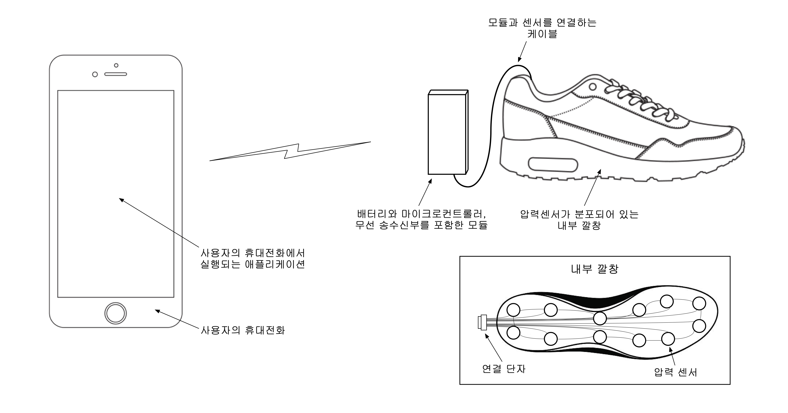

## 문서 개정 이력
|작성일|설명|담당자|
|:-:|:-:|:-:|
|2019.12.01|업로드, 마크다운으로 전환.|송병준|

# 프로젝트 실무 요구사항 분석서
## 프로젝트 명
PRESHOE

## 제작학생명
|학번|이름|연락처|E-mail|
|:-:|:-:|:-:|:-:|
|201701562|송병준|010-****-2661|potados99@gmail.com|
|201701524|강은선|010-****-7047|dmstjs7047@hanmail.net|
|201501495|허설|010-****-6603|hseol96@naver.com|
|201701594|정재희|010-****-3018|wjfwogml5890@naver.com|

## 개발목표
신발에 가해지는 압력을 고해상도로 분석하여 보행과 관련된 데이터를 얻을 수 있다.    
이를 가공하여 얻어낼 수 있는 걸음 수, 무게중심, 보행 각, 걷는 속력, 체중 등의 정보를 통해 사용자에게 맞춤 가공된 보행습관 보고서 및 해당 보행 습관에서 비롯될 수 있는 질병에 관한 조언을 제공하려 한다.

## 제작범위
이 프로젝트는 다음 개발 내용을 포함한다 :
1. 사용자의 신발 안에 내장하여 압력 분포를 측정하고 사용자의 모바일 애플리케이션에 해당 데이터를 전달할 센서 모듈
2. 센서 모듈로부터 데이터를 수신하여 이를 분석하여 보행습관 보고서를 생성하여 사용자에게 전달할 모바일 애플리케이션.

## 사용 시나리오

부적절한 걸음걸이는 피로감만 느끼는 것뿐만 아니라, 다리 관절에도 좋지 않고 더 나아가서는 골반, 척추에도 영향을 끼치기 때문에 올바르게 걷는다는 것은 굉장히 중요하다.

병원에서 받는 걸음걸이 교정검사는 비용적인 면에서 무리가 많이 가고, 확실히 이상이 있다고 판단되지 않는 이상 사람들은 병원에 잘 가지 않는다.

이 신발에는 정교한 압력센서가 달려있는데 걸음걸이에 따라 달라지는 압력으로 사용자에게 평상시 걸음걸이는 어떤지, 자세는 어떠한지 모바일 애플리케이션으로 알려준다.

혼자서는 알기 어려운 본인의 부적절한 걸음걸이 습관을 개선할 수 있다. 또한, 몇몇 질병들의 초기증상 중에 하나는 걸음걸이가 달라진다는 것을 알게 되었는데 의학정보를 수집하여 적용하면 후에 질환의 조기발견에 도움이 될 수 있을 것이다.

물론, 시중에 나와 있는 건강 애플리케이션처럼 걸음 수, 평균 속력, 예상 소모 칼로리도 알 수 있기 때문에 특수 신발로 제한 두는 것이 아니라 건강에 관심 있는 사람이라면 누구나 사용가능한 신발이라고도 할 수 있다.

## 문제점

#### 1. 배터리 용량
가볍게 만들어야 하기 때문에 신발 측에 부착될 마이크로컨트롤러가 많은 양의 전력을 소비하면 안 된다.
#### 2. 수집된 데이터의 정확한 분석
수집된 데이터가 매우 방대하고 오차가 많기 때문에 이를 가공하고 보정해야 유의미한 데이터를 추출해낼 수 있다.
#### 3. 소형화, 경량화
신발에 부착되는 장비이기 때문에 무겁거나 너무 크게 만들 수 없다.
