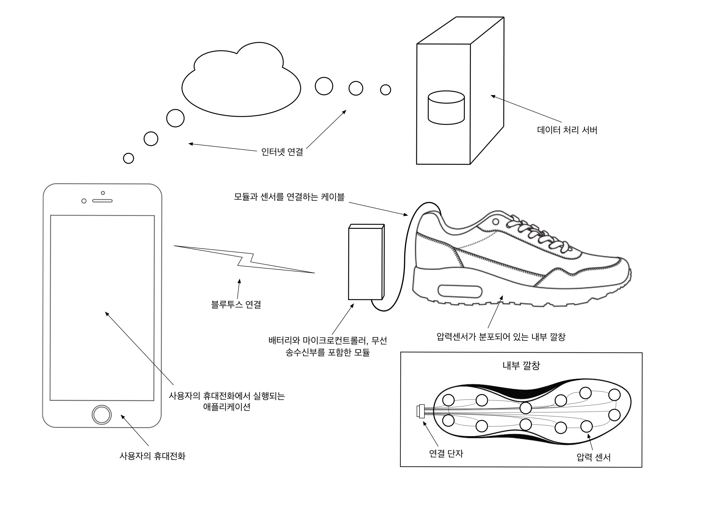

## 문서 개정 이력
|작성일|설명|담당자|
|:-:|:-:|:-:|
|2019.12.01|업로드, 마크다운으로 전환.|송병준|
|2019.12.01|내용 추가.|송병준|
|2019.12.02|서버 역할 수정.|허설|
|2019.12.02|서버 요구사항 추가.|송병준|

# 프로젝트 실무 요구사항 분석서
## 프로젝트 명
Preshoes(프레슈)

## 제작학생명
|학번|이름|연락처|E-mail|
|:-:|:-:|:-:|:-:|
|201701562|송병준|010-****-2661|potados99@gmail.com|
|201701524|강은선|010-****-7047|dmstjs7047@hanmail.net|
|201501495|허설|010-****-6603|hseol96@naver.com|
|201701594|정재희|010-****-3018|wjfwogml5890@naver.com|

## 개발목표
**일상 생활 속에서도 간편하게 자신의 보행 습관을 기록, 분석하고 빠르게 시각적 피드백을 받을 수 있도록 한다.**

신발에 가해지는 압력을 고해상도로 분석하여 보행과 관련된 데이터를 얻을 수 있다.    
이를 가공하여 얻어낼 수 있는 걸음 수, 무게중심, 보행 각도, 걷는 속력, 체중 등의 정보를 통해 사용자에게 맞춤 가공된 보행습관 보고서 및 해당 보행 습관에서 비롯될 수 있는 질병에 관한 조언을 제공하고자 한다.

## 제작범위

### 1. 센서 모듈
센서 모듈은 신발 내/외에 위치하며, 사용자의 발에 가해지는 압력의 분포를 측정 및 수집하여 사용자의 휴대 전화로 전송하는 역할을 한다.

>### 압력 센서로부터 데이터 수집
>신발 내에 분포된 압력 센서들로부터 데이터를 빠르게 읽는다.

>### 수집된 데이터 전송
>센서로부터 수집되 데이터를 가장 효율적인 형태로 가공하여 사용자의 휴대전화로 전송한다.

기술의 한계로 신발 외부로 노출되는 지점이 존재할 것이기 때문에 충격 뿐만 아니라 수분, 먼지 등의 오염에 강해야 한다. 또한 배터리를 사용해 구동될 것이기 때문에 사용에 지장이 없을 만큼의 배터리 사용 시간을 보장해야 한다.

모듈이 제공하는 데이터는 발 전체의 압력을 비교적 고해상도로 그려낼 수 있을 만큼 상세하여야 한다. 물론 전송 과정에서의 지연 또한 최소화해야 한다.

만약 센서 모듈이 너무 비대하고 무겁다면 실생활에서의 사용이 어려울 것이기 때문에 가볍고 작아야 한다.

따라서 센서 모듈은 다음의 요구 사항을 충족하여야 한다:
- **내진, 방진, 방수**
- **심미성을 해치지 않을 만큼 작은 부피**
- **사용성을 해치지 않을 만큼 적은 무게**
- **최소 10시간의 배터리 성능**
- **최소 12개 이상의 압력 센서**
- **적은 지연 시간**

### 2. 애플리케이션
사용자의 휴대전화에 설치되어 구동되며, 신발에 위치한 센서 모듈로부터 압력 측정 데이터를 수집하여 가공하여 사용자에게 보여준다.     
또한 이를 피트니스 기능과 접목시켜 걷기 또는 뛰기 운동을 기록하고, 이를 기반으로 상세한 운동 보고서를 보여준다.

애플리케이션은 크게 다섯 가지 기능을 제공한다.

>### 현재 발 압력분포 상태 확인
>애플리케이션이 수신한 데이터를 바로 발 모형 그래픽으로 시각화하여 보여준다. 실시간으로 발에 가해지는 압력의 분포를 볼 수 있도록 한다.

>### 정적 족저압 검사
>가만히 정지해있는 상태에서 발에 가해지는 압력 분포를 분석함으로써 가만히 서 있는 자세를 진단하고 이에 대한 피드백을 전달한다.

>### 걷기 또는 뛰기 운동 기록
>휴대전화의 GPS와 고도계 등과 협력하여 걷기 또는 뛰기 운동을 기록한다. 운동 중에는 커다란 UI를 제공하여 현재 이동 거리, 속력, 소모 열량, 자세 진단 등을 표시한다.

>### 운동 기록과 상세 보고서 열람
>운동 기록을 정밀하게 분석하여 이동 거리, 운동 시간, 평균 속력, 소모 열량, 이동 고도 등 일반적인 지표 뿐만 아니라 양발 밸런스, 무게중심 이심률, 보행 각도, 보행 습관 진단 등 심층적인 정보를 제공한다.

>### 설정
>애플리케이션을 사용하면서 발생할 수 있는 요구에 대응하기 위한 개인화 설정, 기기 동기화 설정 등을 제공한다.

일상에서 자주 쓰이는 애플리케이션은 대부분 예쁘면서 사용하기도 편하다. Preshoe 애플리케이션이 일상에서 활용 가능한 수준이 되려면 예쁘고 사용하기도 편해야 한다.

애플리케이션은 작동 중에는 항상 두 개의 센서 모듈과 연결되어 있어야 한다. 이 연결은 사용 중에는 절대로 끊어져서는 아니되므로 높은 안정성이 요구된다.

지속적으로 무선 통신을 주고받기 때문에 배터리 성능을 잃기 쉽다. 최적화된 저전력 설계를 구현해야 한다.

애플리케이션이 실행 도중 별도의 조치 없이 종료되거나 아무 응답이 없는 상황은 사용자가 애플리케이션에서 경험할 수 있는 최악의 경우이므로 반드시 막아야 한다.

따라서 애플리케이션은 다음의 요구사항을 만족하여야 한다:
- **프로덕션 수준의 심미성**
- **매뉴얼이 필요 없을 만큼의 사용성**
- **배터리 사용량 최소화**
- **빠른 페어링**
- **안정적인 무선 연결**
- **0%대의 ANR과 처리되지 않은 예외 발생률**

### 3. 서버
온라인 스토리지로서 모바일 애플리케이션을 보조하는 역할을 한다.    
신발로부터 수집한 운동 데이터 등을 사용자의 계정과 연결하여 저장하고 요청에 따라 가공하여 사용자에게 이를 제공한다.

> ### 회원 관리
>회원 가입, 로그인, 비밀번호 찾기 등의 기능을 제공한다.

>### 데이터 분석
>사용자의 발 압력 기록을 분석하여 진단하며, 이에 대한 보고서를 생성한다.

> ### 데이터 동기화 및 백업
>사용자의 로컬 데이터의 복사본을 유지하면서, 사용자의 휴대전화와 서버가 같은 가지도록 동기화한다.

서버는 애플리케이션이 보낸 방대한 압력 데이터를 가공하여 이에 대한 분석을 내놓아야 한다. 데이터의 양은 30분 기준 text 2MB가 넘을 정도로 방대하기 때문에 충분한 처리 성능이 필요하다.

자료의 가공 및 분석은 애플리케이션이 제공하는 핵심적인 기능으로, 이를 안정적으로 제공하기 위해 서버는 항상 클라이언트의 요청에 응답할 준비가 되어 있어야 한다.

서버에 저장된 자료는 안전한 형태로 암호화되어있어야 함은 물론이고, 통신 과정에서 민감한 정보가 유출될 우려가 있기 때문에 모든 오고가는 데이터에 종단간 암호화를 적용해야 한다.

따라서 서버는 다음의 요구사항을 만족하여야 한다:
- **충분한 처리 성능**
- **안정된 성능**
- **보안**

## 사용 시나리오
부적절한 걸음걸이는 피로감만 느끼는 것뿐만 아니라, 다리 관절에도 좋지 않고 더 나아가서는 골반, 척추에도 영향을 끼치기 때문에 올바르게 걷는다는 것은 굉장히 중요하다.

병원에서 받는 걸음걸이 교정검사는 비용적인 면에서 무리가 많이 가고, 확실히 이상이 있다고 판단되지 않는 이상 사람들은 병원에 잘 가지 않는다.

이 신발에는 정교한 압력센서가 달려있는데 걸음걸이에 따라 달라지는 압력으로 사용자에게 평상시 걸음걸이는 어떤지, 자세는 어떠한지 모바일 애플리케이션으로 알려준다.

혼자서는 알기 어려운 본인의 부적절한 걸음걸이 습관을 개선할 수 있다. 또한, 몇몇 질병들의 초기증상 중에 하나는 걸음걸이가 달라진다는 것을 알게 되었는데 의학정보를 수집하여 적용하면 후에 질환의 조기발견에 도움이 될 수 있을 것이다.

물론, 시중에 나와 있는 건강 애플리케이션처럼 걸음 수, 평균 속력, 예상 소모 칼로리도 알 수 있기 때문에 특수 신발로 제한 두는 것이 아니라 건강에 관심 있는 사람이라면 누구나 사용 가능한 신발이라고도 할 수 있다.

Preshoe는 다음과 같이 사용할 수 있다:

> ### 사용 시나리오 1
> A씨는 고등학교 2학년 때에 오른쪽 발목에 부상을 입은 이후로 재활치료를 소홀히 하였다. 그 결과 A씨는 오래 살짝 대칭이 맞지 않는 보행 습관을 가지게 되었다. 딱히 정형외과적 질환이 나타나지 않아 병원에 갈 필요를 느끼지 못한 A씨는 `Preshoe`를 접하게 된다. `Preshoe`를 신발에 설치하고 애플리케이션을 설치하여 사용 준비를 끝낸 A씨는 제일 먼저 가만히 서서 **족저압검사** 를 실시한다. A씨는 자신의 왼쪽 발에 조금 더 무게가 실림을 처음을 알게 된다. 더 자세한 정보가 궁금했던 A씨는 잠시 집 앞으로 나와 15분간 **걷기 운동** 을 기록한다. 운동을 마치자 운동 결과와 함께 보고서가 **운동 기록** 목록에 떠오른다. 보고서에는 다음과 같은 요약이 쓰여 있다: '*오른발보다 왼발에 많은 무게가 가해짐. 앞꿈치보다 뒷꿈치에 많은 무게가 가해짐. 보행 각도는 약 20도 정도로 팔자 걸음과 골반 비대칭이 의심됨.*' 상상도 못한 자신의 상태에 놀란 A씨는 그 이후로 걸음에 각별히 신경쓰게 되었고, 종종 **현재 상태** 기능을 활용하여 자신이 땅을 올바로 딛고 서 있는지 확인한다.

## 문제점
### 1. 배터리 용량
가볍게 만들어야 하기 때문에 신발 측에 부착될 마이크로컨트롤러가 많은 양의 전력을 소비하면 안 된다.
### 2. 수집된 데이터의 정확한 분석
수집된 데이터가 매우 방대하고 오차가 많기 때문에 이를 가공하고 보정해야 유의미한 데이터를 추출해낼 수 있다.
### 3. 소형화, 경량화
신발에 부착되는 장비이기 때문에 무겁거나 너무 크게 만들 수 없다.
### 4. 블루투스 동시 페어링
한 쌍의 시스템에서 두 개의 모듈이 하나에 휴대전화에 실시간 동기화되어야 한다.
